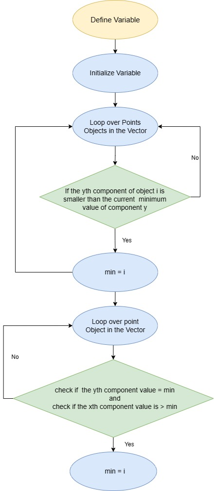

# Name  : Jil Majiwala
# ID : 202001230
# Lab : 7
# Objective : White box and Black Box Testing

# Section A

Equivalence Partitioning Test Cases:

<table>
  <tr>
    <th>Tester Action and Input Data</th>
    <th>Expected Outcome</th>
  </tr>
  <tr>
    <td>Valid input: day=1, month=1, year=1900</td>
    <td>Invalid date</td>
  </tr>
  <tr>
    <td>Valid input: day=31, month=12, year=2015</td>
    <td>Previous date</td>
  </tr>
  <tr>
    <td>Invalid input: day=0, month=6, year=2000</td>
    <td>An error message</td>
  </tr>
  <tr>
    <td>Invalid input: day=32, month=6, year=2000</td>
    <td>An error message</td>
  </tr>
  <tr>
    <td>Invalid input: day=29, month=2, year=2001</td>
    <td>An error message</td>
  </tr>
</table>

Boundary Value Analysis Test Cases:

<table>
  <tr>
    <th>Tester Action and Input Data</th>
    <th>Expected Outcome</th>
  </tr>
  <tr>
    <td>Valid input: day=1, month=1, year=1900</td>
    <td>Invalid date</td>
  </tr>
  <tr>
    <td>Valid input: day=31, month=12, year=2015</td>
    <td>Previous date</td>
  </tr>
  <tr>
    <td>Invalid input: day=0, month=6, year=2000</td>
    <td>An error message</td>
  </tr>
  <tr>
    <td>Invalid input: day=32, month=6, year=2000</td>
    <td>An error message</td>
  </tr>
  <tr>
    <td>Invalid input: day=29, month=2, year=2000</td>
    <td>An error message</td>
  </tr>
  <tr>
    <td>Valid input: day=1, month=6, year=2000</td>
    <td>Previous date</td>
  </tr>
  <tr>
    <td>Valid input: day=31, month=5, year=2000</td>
    <td>Previous date</td>
  </tr>
  <tr>
    <td>Valid input: day=15, month=6, year=2000</td>
    <td>Previous date</td>
  </tr>
  <tr>
    <td>Invalid input: day=31, month=4, year=2000</td>
    <td>An error message</td>
  </tr>
</table>
</br>

### Problem 1 :

```
import org.junit.Test;
import static org.junit.Assert.*;

public class LinearSearchTest {

  @Test
  public void testExistingValue() {
    int[] arr = {1, 2, 3, 4, 5};
    int index = linearSearch(3, arr);
    assertEquals(2, index);
  }

  @Test
  public void testNonExistingValue() {
    int[] arr = {1, 2, 3, 4, 5};
    int index = linearSearch(6, arr);
    assertEquals(-1, index);
  }

  @Test
  public void testFirstElement() {
    int[] arr = {1, 2, 3, 4, 5};
    int index = linearSearch(1, arr);
    assertEquals(0, index);
  }

  @Test
  public void testLastElement() {
    int[] arr = {1, 2, 3, 4, 5};
    int index = linearSearch(5, arr);
    assertEquals(4, index);
  }

  @Test
  public void testEmptyArray() {
    int[] arr = {};
    int index = linearSearch(1, arr);
    assertEquals(-1, index);
  }

  @Test
  public void testNullArray() {
    int[] arr = null;
    int index = linearSearch(1, arr);
    assertEquals(-1, index);
  }
}
```

### Equivalence Partitioning:

<table>
  <thead>
    <tr>
      <th>Tester Action and Input Data</th>
      <th>Expected Outcome</th>
    </tr>
  </thead>
  <tbody>
    <tr>
      <td>Test with v as a non-existent value and an empty array a[]</td>
      <td>-1</td>
    </tr>
    <tr>
      <td>Test with v as a non-existent value and a non-empty array a[]</td>
      <td>-1</td>
    </tr>
    <tr>
      <td>Test with v as an existent value and an empty array a[]</td>
      <td>-1</td>
    </tr>
    <tr>
      <td>Test with v as an existent value and a non-empty array a[] where v exists</td>
      <td>the index of v in a[]</td>
    </tr>
    <tr>
      <td>Test with v as an existent value and a non-empty array a[] where v does not exist</td>
      <td>-1</td>
    </tr>
  </tbody>
</table>

### Boundary Value Analysis:

<table>
  <thead>
    <tr>
      <th>Tester Action and Input Data</th>
      <th>Expected Outcome</th>
    </tr>
  </thead>
  <tbody>
    <tr>
      <td>Test with v as a non-existent value and an empty array a[]</td>
      <td>-1</td>
    </tr>
    <tr>
      <td>Test with v as a non-existent value and a non-empty array a[]</td>
      <td>-1</td>
    </tr>
    <tr>
      <td>Test with v as an existent value and an array a[] of length 0</td>
      <td>-1</td>
    </tr>
    <tr>
      <td>Test with v as an existent value and an array a[] of length 1, where v exists</td>
      <td>0</td>
    </tr>
    <tr>
      <td>Test with v as an existent value and an array a[] of length 1, where v does not exist</td>
      <td>-1</td>
    </tr>
    <tr>
      <td>Test with v as an existent value and an array a[] of length greater than 1, where v exists at the beginning of the array</td>
      <td>0</td>
    </tr>
    <tr>
      <td>Test with v as an existent value and an array a[] of length greater than 1, where v exists at the end of the array</td>
      <td>the last index where v is found</td>
    </tr>
    <tr>
      <td>Test with v as an existent value and an array a[] of length greater than 1, where v exists in the middle of the array</td>
      <td>the index where v is found</td>
    </tr>
  </tbody>
</table>
</br>

### Problem 2 :

### Equivalence Partitioning:

<table>
  <thead>
    <tr>
      <th>Tester Action and Input Data</th>
      <th>Expected Outcome</th>
    </tr>
  </thead>
  <tbody>
    <tr>
      <td>Test with v as a non-existent value and an empty array a[]</td>
      <td>0</td>
    </tr>
    <tr>
      <td>Test with v as a non-existent value and a non-empty array a[]</td>
      <td>0</td>
    </tr>
    <tr>
      <td>Test with v as an existent value and an empty array a[]</td>
      <td>0</td>
    </tr>
    <tr>
      <td>Test with v as an existent value and a non-empty array a[] where v exists multiple times</td>
      <td>the number of occurrences of v in a[]</td>
    </tr>
    <tr>
      <td>Test with v as an existent value and a non-empty array a[] where v exists only once</td>
      <td>1</td>
    </tr>
  </tbody>
</table>

### Boundary Value Analysis:

<table>
  <thead>
    <tr>
      <th>Tester Action and Input Data</th>
      <th>Expected Outcome</th>
    </tr>
  </thead>
  <tbody>
    <tr>
      <td>Test with v as a non-existent value and an empty array a[]</td>
      <td>0</td>
    </tr>
    <tr>
      <td>Test with v as a non-existent value and a non-empty array a[]</td>
      <td>0</td>
    </tr>
    <tr>
      <td>Test with v as an existent value and an array a[] of length 0</td>
      <td>0</td>
    </tr>
    <tr>
      <td>Test with v as an existent value and an array a[] of length 1, where v exists</td>
      <td>1</td>
    </tr>
    <tr>
      <td>Test with v as an existent value and an array a[] of length 1, where v does not exist</td>
      <td>0</td>
    </tr>
    <tr>
      <td>Test with v as an existent value and an array a[] of length greater than 1, where v exists at the beginning of the array</td>
      <td>the number of occurrences of v in a[]</td>
    </tr>
    <tr>
      <td>Test with v as an existent value and an array a[] of length greater than 1, where v exists at the end of the array</td>
      <td>the number of occurrences of v in a[]</td>
    </tr>
    <tr>
      <td>Test with v as an existent value and an array a[] of length greater than 1, where v exists in the middle of the array</td>
      <td>the number of occurrences of v in a[]</td>
    </tr>
  </tbody>
</table>
</br>

### Problem 3 :

### Equivalence Partitioning:

<table>
  <tr>
    <th>Tester Action and Input Data</th>
    <th>Expected Outcome</th>
  </tr>
  <tr>
    <td>v=5, a=[1, 3, 5, 7, 9]</td>
    <td>2</td>
  </tr>
  <tr>
    <td>v=1, a=[1, 3, 5, 7, 9]</td>
    <td>0</td>
  </tr>
  <tr>
    <td>v=9, a=[1, 3, 5, 7, 9]</td>
    <td>4</td>
  </tr>
  <tr>
    <td>v=4, a=[1, 3, 5, 7, 9]</td>
    <td>-1</td>
  </tr>
  <tr>
    <td>v=11, a=[1, 3, 5, 7, 9]</td>
    <td>-1</td>
  </tr>
</table>

### Boundary Value Analysis:

<table>
  <tr>
    <th>Tester Action and Input Data</th>
    <th>Expected Outcome</th>
  </tr>
  <tr>
    <td>v=1, a=[1]</td>
    <td>0</td>
  </tr>
  <tr>
    <td>v=9, a=[9]</td>
    <td>0</td>
  </tr>
  <tr>
    <td>v=5, a=[]</td>
    <td>-1</td>
  </tr>
  <tr>
    <td>v=5, a=[5, 7, 9]</td>
    <td>0 (smallest element in the array)</td>
  </tr>
  <tr>
    <td>v=5, a=[1, 3, 5]</td>
    <td>2 (largest element in the array)</td>
  </tr>
</table>
</br>

### Problem 4 :

### Boundary Value Analysis:

<table>
  <tr>
    <th>Tester Action and Input Data</th>
    <th>Expected Outcome</th>
  </tr>
  <tr>
    <td>Invalid inputs: a = 0, b = 0, c = 0</td>
    <td>INVALID</td>
  </tr>
  <tr>
    <td>Invalid inputs: a + b = c or b + c = a or c + a = b (a=3, b=4, c=8)</td>
    <td>INVALID</td>
  </tr>
  <tr>
    <td>Equilateral triangles: a = b = c = 1</td>
    <td>EQUILATERAL</td>
  </tr>
  <tr>
    <td>Equilateral triangles: a = b = c = 100</td>
    <td>EQUILATERAL</td>
  </tr>
  <tr>
    <td>Isosceles triangles: a = b ≠ c = 10</td>
    <td>ISOSCELES</td>
  </tr>
  <tr>
    <td>Isosceles triangles: a ≠ b = c = 10</td>
    <td>ISOSCELES</td>
  </tr>
  <tr>
    <td>Isosceles triangles: a = c ≠ b = 10</td>
    <td>ISOSCELES</td>
  </tr>
  <tr>
    <td>Scalene triangles: a = b + c - 1</td>
    <td>SCALENE</td>
  </tr>
  <tr>
    <td>Scalene triangles: b = a + c - 1</td>
    <td>SCALENE</td>
  </tr>
  <tr>
    <td>Scalene triangles: c = a + b - 1</td>
    <td>SCALENE</td>
  </tr>
  <tr>
    <td>Maximum values: a, b, c = Integer.MAX_VALUE</td>
    <td>INVALID</td>
  </tr>
  <tr>
    <td>Minimum values: a, b, c = Integer.MIN_VALUE</td>
    <td>INVALID</td>
  </tr>
</table>

### Equivalence Partitioning:

<table>
  <tr>
    <th>Tester Action and Input Data</th>
    <th>Expected Outcome</th>
  </tr>
  <tr>
    <td>Valid input: a=3, b=3, c=3</td>
    <td>EQUILATERAL</td>
  </tr>
  <tr>
    <td>Valid input: a=4, b=4, c=5</td>
    <td>ISOSCELES</td>
  </tr>
  <tr>
    <td>Valid input: a=5, b=4, c=3</td>
    <td>SCALENE</td>
  </tr>
  <tr>
    <td>Invalid input: a=0, b=0, c=0</td>
    <td>INVALID</td>
  </tr>
  <tr>
    <td>Invalid input: a=-1, b=2, c=3</td>
    <td>INVALID</td>
  </tr>
  <tr>
    <td>Valid input: a=1, b=1, c=1</td>
    <td>EQUILATERAL</td>
  </tr>
  <tr>
    <td>Valid input: a=2, b=2, c=1</td>
    <td>ISOSCELES</td>
  </tr>
  <tr>
    <td>Valid input: a=3, b=4, c=5</td>
    <td>SCALENE</td>
  </tr>
  <tr>
    <td>Invalid input: a=0, b=1, c=1</td>
    <td>INVALID</td>
  </tr>
  <tr>
    <td>Invalid input: a=1, b=0, c=1</td>
    <td>INVALID</td>
  </tr>
  <tr>
    <td>Invalid input: a=1, b=1, c=0</td>
    <td>INVALID</td>
  </tr>
</table>
</br>

### Problem 5 :

### Equivalence Partitioning:
<table>
  <tr>
    <th>Tester Action and Input Data</th>
    <th>Expected Outcome</th>
  </tr>
  <tr>
    <td>Valid Inputs: s1 = "hello", s2 = "hello world"</td>
    <td>true</td>
  </tr>
  <tr>
    <td>Valid Inputs: s1 = "a", s2 = "abc"</td>
    <td>true</td>
  </tr>
  <tr>
    <td>Invalid Inputs: s1 = "", s2 = "hello world"</td>
    <td>false</td>
  </tr>
  <tr>
    <td>Invalid Inputs: s1 = "world", s2 = "hello world"</td>
    <td>false</td>
  </tr>
</table>

### Boundary Value Analysis:
<table>
  <tr>
    <th>Tester Action and Input Data</th>
    <th>Expected Outcome</th>
  </tr>
  <tr>
    <td>s1 = "", s2 = "abc"</td>
    <td>False</td>
  </tr>
  <tr>
    <td>s1 = "ab", s2 = "abc"</td>
    <td>True</td>
  </tr>
  <tr>
    <td>s1 = "abc", s2 = "ab"</td>
    <td>False</td>
  </tr>
  <tr>
    <td>s1 = "a", s2 = "ab"</td>
    <td>True</td>
  </tr>
  <tr>
    <td>s1 = "aaaaaaaaaaaaaaaaaaaaaa", s2 = "aaaaaaaaaaaaaaaaaaaaaab"</td>
    <td>True</td>
  </tr>
  <tr>
    <td>s1 = "abc", s2 = "abc"</td>
    <td>True</td>
  </tr>
  <tr>
    <td>s1 = "a", s2 = "b"</td>
    <td>False</td>
  </tr>
  <tr>
    <td>s1 = "a", s2 = "a"</td>
    <td>True</td>
  </tr>
  <tr>
    <td>s1 = "a", s2 = "b"</td>
    <td>False</td>
  </tr>
  <tr>
    <td>s1 = "a", s2 = " "</td>
    <td>False</td>
  </tr>
</table>
</br>

### Problem 6 :
### A. Equivalence classes for the system

The possible equivalence classes and their corresponding conditions are as follows:

| Equivalence Class    | Neccessary Condition                                  |
| -------------------- | ----------------------------------------------------- |
| Invalid Triangle     | A > B+C or B > A+C or C > A+B                         |
| Scalene Triangle     | A != B and B != C and C != A                          |
| Isoceles Triangle    | either A == B or B == C or A == C                     |
| Equilateral Triangle | A == B and B == C                                     |
| Right-angle Triangle | A^2 + B^2 = C^2 or A^2 = B^2 + C^2 or B^2 + A^2 = C^2 |

### B. Test Cases for Equivalence Classes

Following are list of test cases each belonging to one of the defined Equivalence class

| Test Case | Condition           | Expected Outcome     |
| --------- | ------------------- | -------------------- |
| 1         | A = 5, B = 5, C = 5 | Equilateral Triangle |
| 2         | A = 3, B = 4, C = 5 | Right-angle Triangle |
| 3         | A = 2, B = 2, C = 3 | Isosceles Triangle   |
| 4         | A = 4, B = 4, C = 7 | Scalene Triangle     |
| 5         | A = 1, B = 1, C = 3 | Invalid Triangle     |

### C. Boundary Condition A + B > C (scalene triangle)

Below is the list of possible corner cases looking like scalene triangle but are not

| Test Case | Condition                 | Expected Outcome |
| --------- | ------------------------- | ---------------- |
| 1         | A = 2, B = 3, C = 5       | Invalid Triangle |
| 2         | A = 1, B = 2, C = 3       | Invalid Triangle |
| 3         | A = 1, B = 1, C = 2       | Invalid Triangle |
| 4         | A = 0.1, B = 0.1, C = 0.3 | Invalid Triangle |
| 5         | A = 1, B = 2, C = 2.9     | Scalene Triangle |

### D. Boundary Condition A = C (isosceles triangle)

Below is the list of possible corner cases looking like isosceles triangle but are not

| Test Case | Condition                   | Expected Outcome   |
| --------- | --------------------------- | ------------------ |
| 1         | A = -4, B = 3, C = -4       | Invalid Triangle   |
| 2         | A = 0, B = 2, C = 0         | Invalid Triangle   |
| 3         | A = 1, B = 3, C = 1         | Invalid Triangle   |
| 4         | A = 0.1, B = 0.3, C = 0.1   | Invalid Triangle   |
| 5         | A = 0.15, B = 0.2, C = 0.15 | Isosceles Triangle |

### E. Boundary Condition A = B = C (equilateral triangle)

Below is the list of possible corner cases looking like isosceles triangle but are not

| Test Case | Condition                 | Expected Outcome     |
| --------- | ------------------------- | -------------------- |
| 1         | A = -4, B = -4, C = -4    | Invalid Triangle     |
| 2         | A = 0, B = 0, C = 0       | Invalid Triangle     |
| 3         | A = 10, B = 10, C = 10    | Equilateral Triangle |
| 4         | A = 0.1, B = 0.1, C = 0.1 | Equilateral Triangle |

### F. Boundary Condition $A^2$ + $B^2$ = $C^2$ (right-angle triangle)

Below is the list of possible corner cases looking like right-angle triangle but are not

| Test Case | Condition                    | Expected Outcome      |
| --------- | ---------------------------- | --------------------- |
| 1         | A = 3, B = 4, C = 5          | Right Angled Triangle |
| 2         | A = -4, B = -3, C = 5        | Invalid Triangle      |
| 3         | A = -1, B = -1.414, C = 1.73 | Invalid Triangle      |
| 3         | A = 1, B = 1.414, C = 1.73   | Right Angled Triangle |

### G. Non-triangle Case

Below is the list of possible Invalid Triangle cases

| Test Case | Condition                    | Expected Outcome |
| --------- | ---------------------------- | ---------------- |
| 1         | A = 3, B = 4, C = 8          | Invalid Triangle |
| 2         | A = -4, B = -3, C = 5        | Invalid Triangle |
| 3         | A = -1, B = -1.414, C = 1.73 | Invalid Triangle |
| 4         | A = 111, B = 1.414, C = 9.73 | Invalid Triangle |
| 5         | A = 1, B = 53, C = 9.73      | Invalid Triangle |
| 6         | A = 1, B = 1.414, C = -9.73  | Invalid Triangle |
| 7         | A = 0, B = 0, C = 0          | Invalid Triangle |

### H. Non-positive Input

Below is the list of possible Invalid Triangle cases

| Test Case | Condition        | Expected Outcome |
| --------- | ---------------- | ---------------- |
| 1         | a=-1, b=2, c=3   | Invalid Triangle |
| 2         | a=-4, b=-5, c=-7 | Invalid Triangle |
| 3         | a=1, b=-5, c=10  | Invalid Triangle |

---

# Section B
### 1. Control Flow Graph (CFG):



### 2. Criteria specific test case for flow graph

#### a. Statement Coverage

| Test Case | Input                 | Expected Output          |
| --------- | --------------------- | ------------------------ |
| 1         | p=[]                  | Empty Vector             |
| 2         | p=[(1,1)]             | Vector with Single Point |
| 3         | p=[(1,1),(2,2),(3,3)] | Vector with 3 Points     |

#### b. Branch Coverage

| Test Case | Input                       | Expected Output                         |
| --------- | --------------------------- | --------------------------------------- |
| 1         | p=[]                        | Empty Vector                            |
| 2         | p=[(1,1),(2,2)]             | vector with 2 points                    |
| 3         | p=[(1,1),(2,2),(3,1),(4,3)] | vector with four points                 |
| 4         | p=[(1,2),(3,1),(2,1)]       | vector with 3 points in different order |

#### c. Basic Condition Coverage

| Test Case | Input                       | Expected Output                  |
| --------- | --------------------------- | -------------------------------- |
| 1         | p=[]                        | Empty Vector                     |
| 2         | p=[(1,1),(2,2)]             | Vector with two points           |
| 3         | p=[(1,1),(2,2),(3,1),(4,3)] | vector with four points          |
| 4         | p=[(1,2),(3,1),(2,1)]       | Vector with 3 indentical points  |
| 5         | p=[(1,1),(1,1),(1,1)]       | vector with identical points     |
| 6         | p=[(1,1),(2,2),(1,1)]       | vector with two identical points |```
